# 在window下使用docker安装oracle数据库
> 目前docker已经稳定支持window10系统，在window10上安装docker比window其他系统要方便很多，不过这里也讲解下window7的安装方法。


## 安装docker

### window10
访问[Docker官网](https://www.docker.com/)，下载对应Docker。

如图：

1. 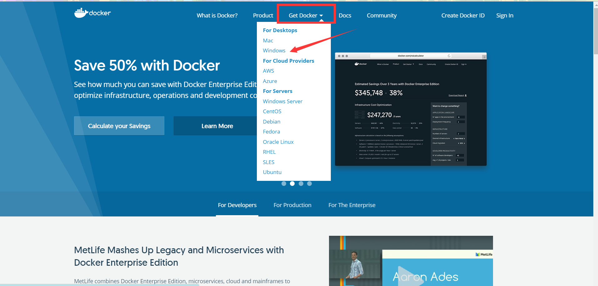

2. 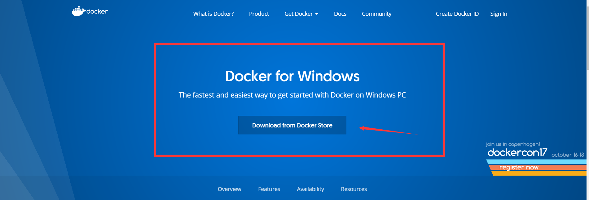

3. 

4. 下载完成后，得到一个.msi的文件，这个是docker的安装向导。

5. 运行该安装向导。
   
    
    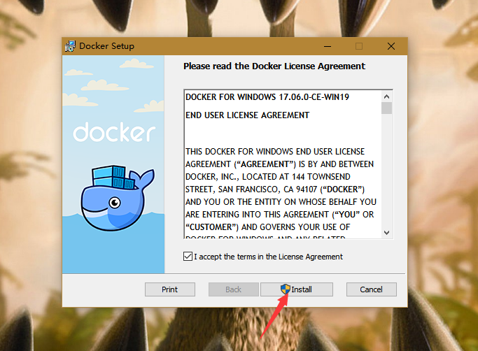
    
6. 打开window10系统的Hyper-V功能。（开始菜单->设置->查找设置，输入控制面板->卸载程序->左侧开启或关闭window功能）
   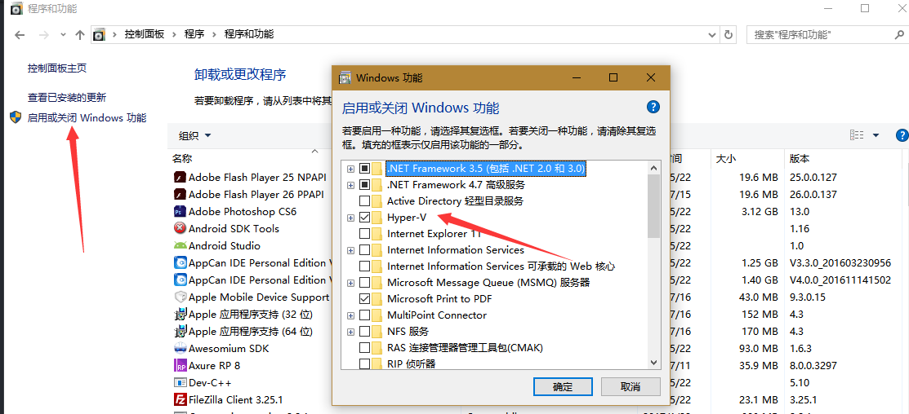
   开启功能后，**会需要重启**，可能多次重启。等待下。。。

7. 点击图标运行 
    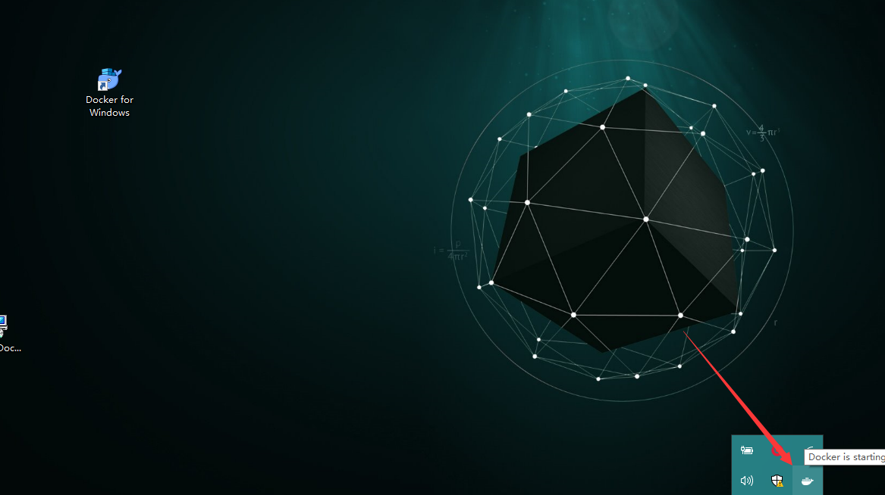

8. 下载boot2docker.iso，
    [github下载地址](https://github.com/boot2docker/boot2docker/releases)。
    下载完成后，将boot2docker.iso复制到C:\Users\Administrator\.docker\machine\cache文件夹下，如果没有machine\cache文件夹，就创建一个。

9. 运行cmd，输入docker，有信息就是安装成功了。（状态栏小图标成功运行后，不然执行其他命令还是会报错。）
   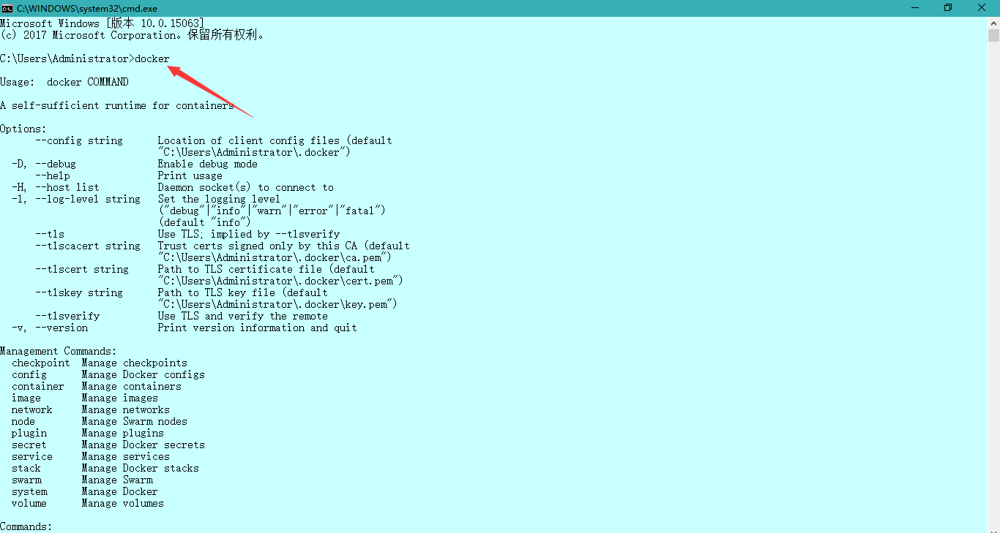
    
### window7
1. 由于没有直接支持window7的安装包，需要在官网上下载能运行docker的工具（DockerToolbox），[链接](https://www.docker.com/products/docker-toolbox)。
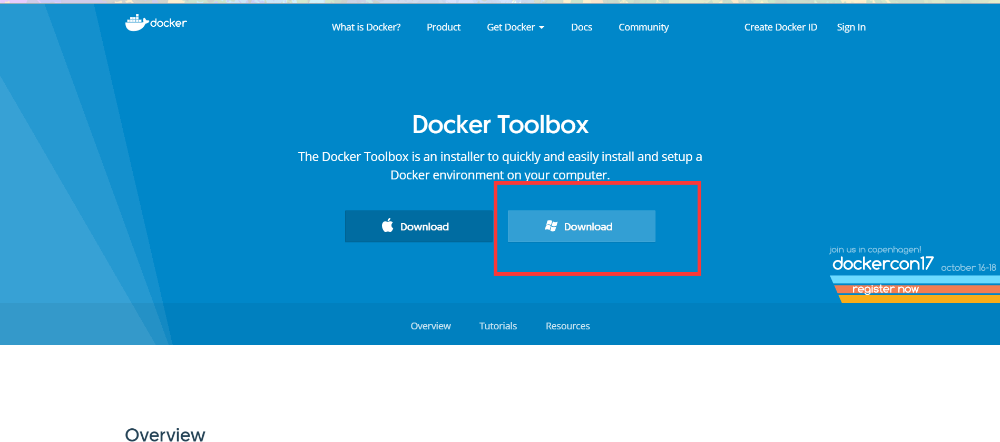
   > 但是这个地址被墙了，下载速度很慢，有vpn的可以尝试下。

2. 访问[国内的资源](http://get.daocloud.io/#install-docker-for-mac-windows) 
  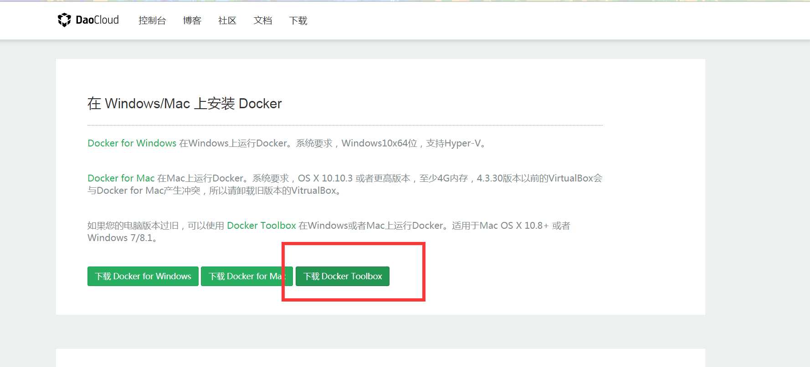
  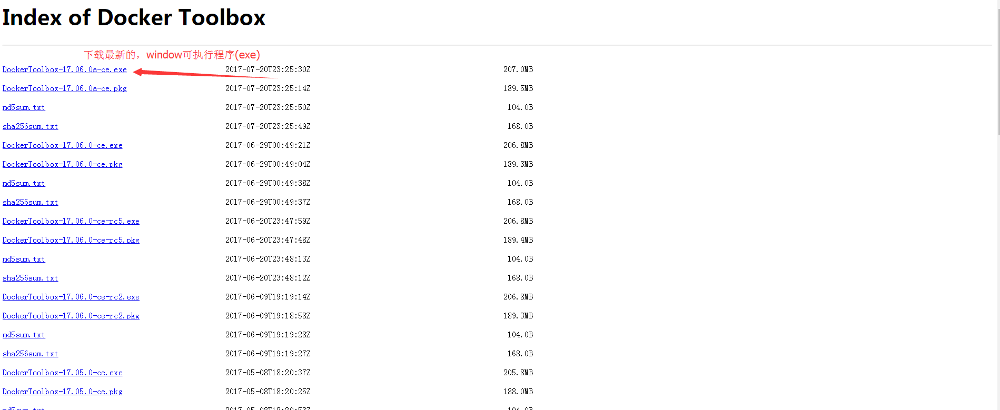

3. 下载完成后，得到安装包

    

4. 点击运行
  
    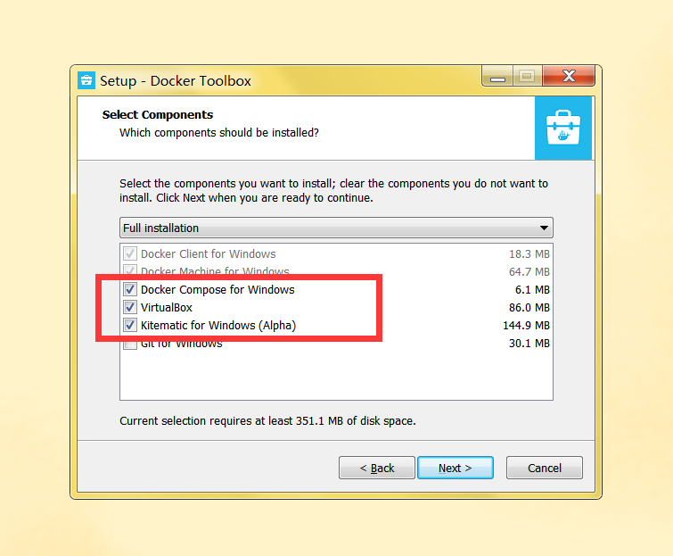
  
   如果没有git的就勾选，安装下吧。
   
    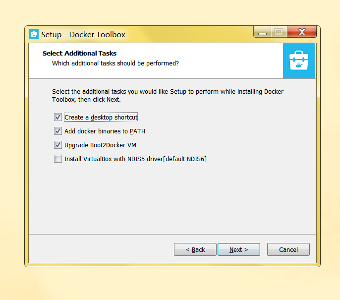

    点击 next 之后点击  install。 等待片刻。。。

5. 安装完成后桌面出现三个图表
    
    

6. 点击Docker Quickstart Terminal初次运行。这一步骤可能会报错。
    1. 手动启动虚拟机，提示VT-x/AMD-V 硬件加速在系统中不可用；
    重启电脑开启cpu支持虚拟机，不同的主板可能操作不同。一般在：高级 -> cpu里面。
    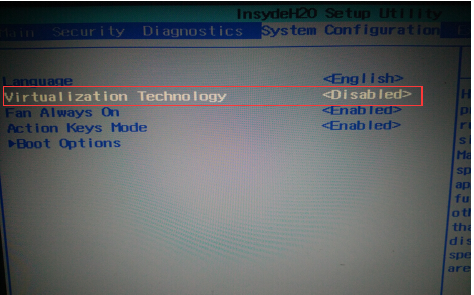 

    2. 虚拟机ip获取不到，这个先放着，之后直接操作虚拟机，更改网络设置，使用其他的链接工具。
    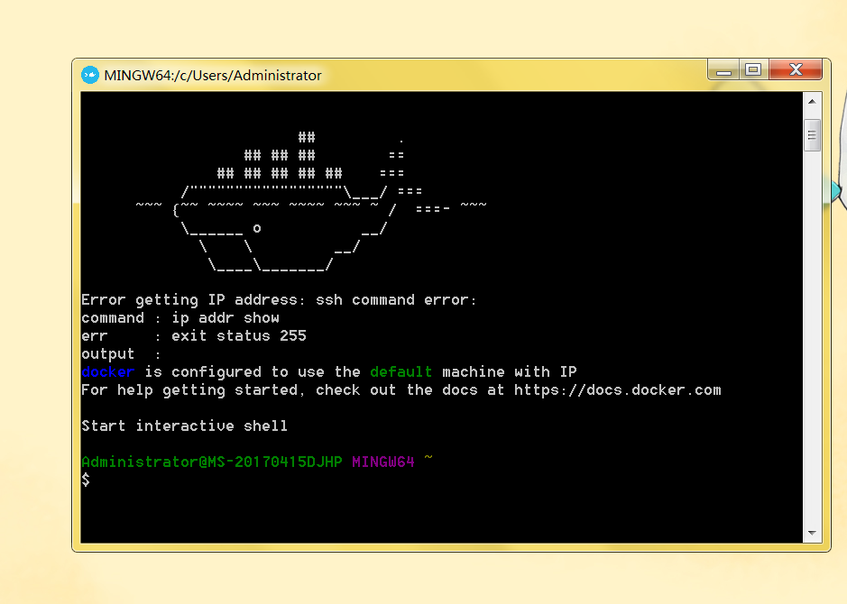

    3. 打开后，若在bash界面提示没有boot2docker镜像，需要在
      github上下载，提示大概如下
      
  
        这是因为没有找到默认的boot2docker镜像的原因，提示正在下载，然而github的下载速度不可恭维，第一反应都是找别的站资源下载。
        不过在一开始安装好的DockerToolbox根目录下就有一个boot2docker.iso。
     
  
         将这个文件拷贝到C:\Users\Administrator\.docker\machine\cache文件夹下，Administrator是当前用户，根据自己实际来。
        拷贝完成之后，再运行Docker Quickstart Terminal，如果还是提示boot2docker.iso不是最新，需要下载，那就老老实实去github上下载吧，[下载地址](https://github.com/boot2docker/boot2docker/releases)。
        同样，下载完后放在C:\Users\Administrator\.docker\machine\cache文件夹下。

      4. 若点击Docker Quickstart Terminal图标后，提示window正在查找bash.exe的话，点击浏览自己查找。一般在Git所安装下的bin目录。

7. 由于Docker Quickstart Terminal这个终端不能复制粘贴，果断放弃选择另外的方法连接docker的宿主虚拟机吧。
    1. 设置虚拟机的网络连接方式，改为桥接，便于虚拟机上网连接
    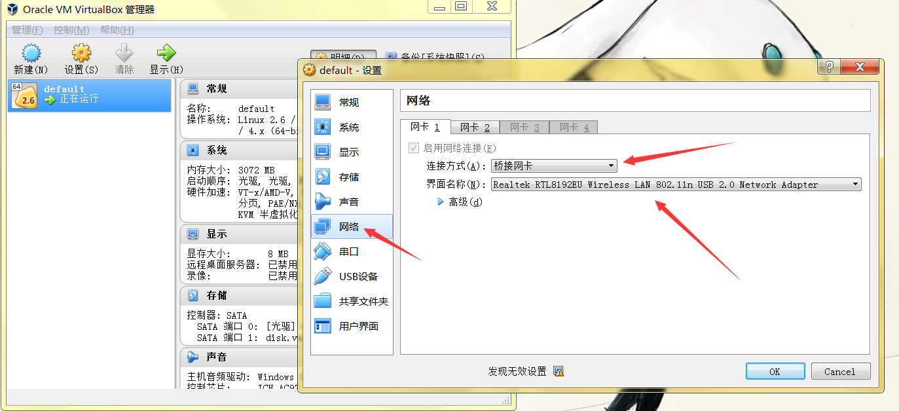
  
    2. 直接进入virtualBox得到ip地址，然后使用连接工具，连接虚拟机。我这里使用的是Xshell5，百度直接下载安装。
    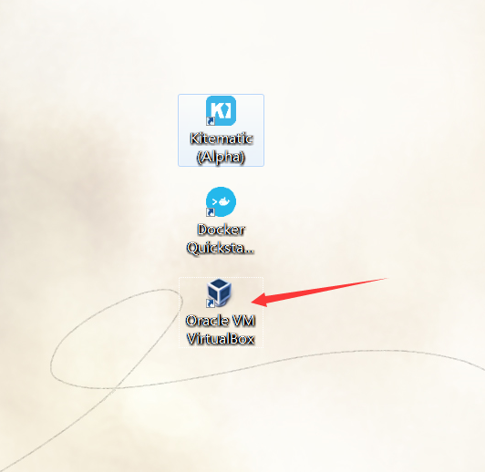
    
    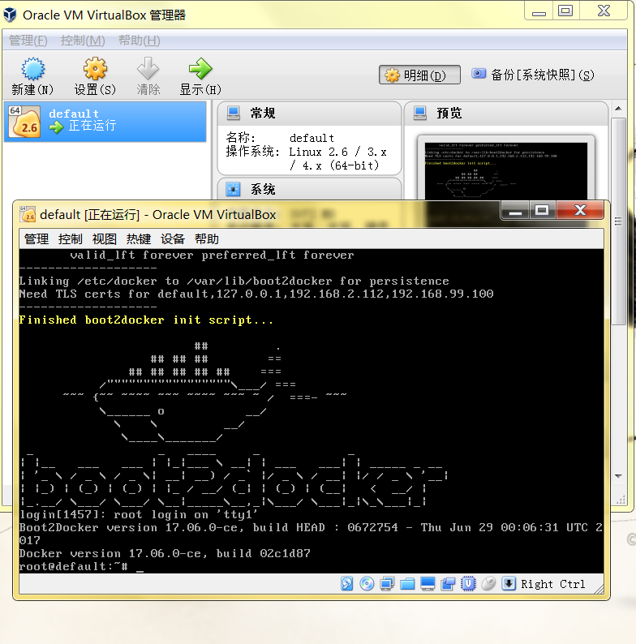
  
        输入命令  ``` ifconfig ``` 
    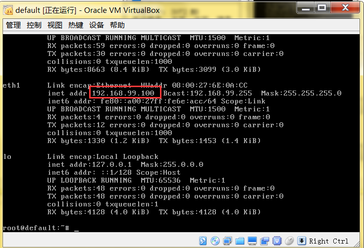
  
        使用这个ip连接虚拟机。默认用户名docker,密码：tcuser
    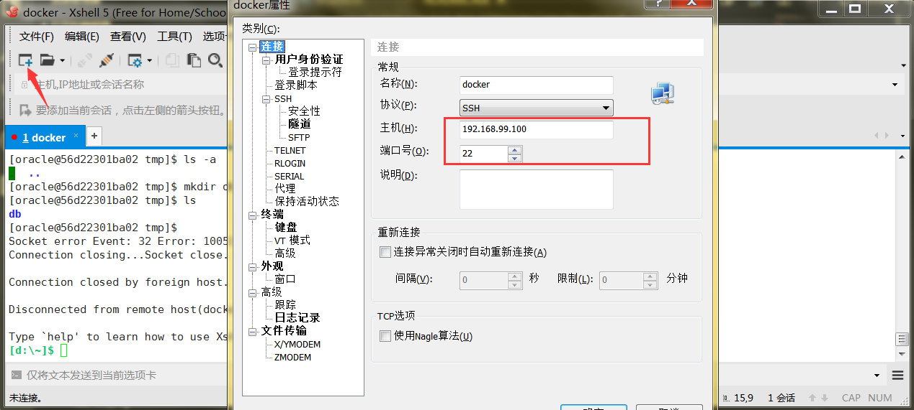
    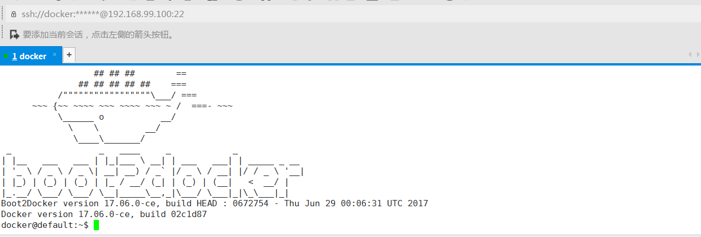

## Docker安装oracle
> docker安装好后，接下来的操作差不多一样了。只是window7是运行在安装的虚拟机的环境里，而window10直接将这个环境嵌入了window系统里，所以window10是直接在系统运行，之后局域网连接oracle就直接使用该电脑的ip，但是window7需要访问虚拟机，访问里面系统的ip地址，使用ifconfg查看eth0的ip。

1. 打开终端，window10（cmd、git bash都行），window7就使用上面的链接工具吧（XShell链接虚拟机）。

2. 访问阿里云的docker镜像仓库。[链接](https://dev.aliyun.com/search.html?spm=5176.1972343.0.1.599c5715zro8kI)

3. 搜索oracle
    
    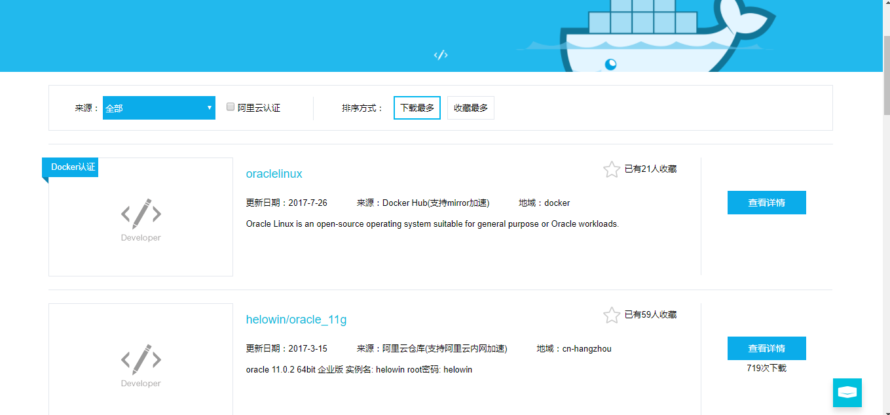

4. 这里选择第二个11G的

    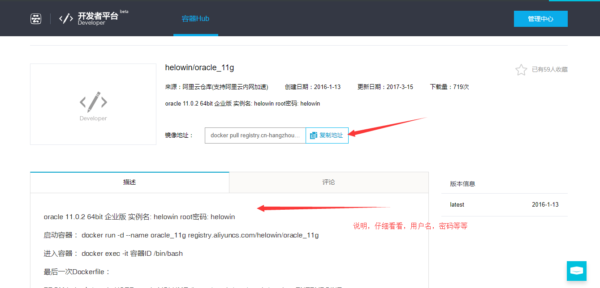

5. 复制地址，在终端运行

    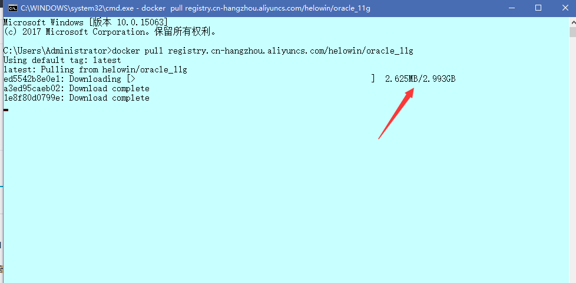
    
    慢慢等吧。。。

6. 运行 ``` docker images ``` 查看镜像


7. 在docker中运行镜像，加上-p参数映射对口，-d 后台运行。更多参数参考文档吧。

    ``` 
    docker run -d -p 1521:1521 --name oracle_11g registry.aliyuncs.com/helowin/oracle_11g
    ```
