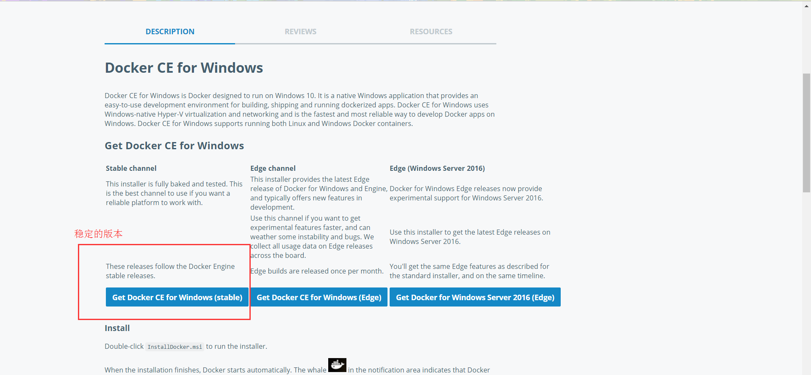
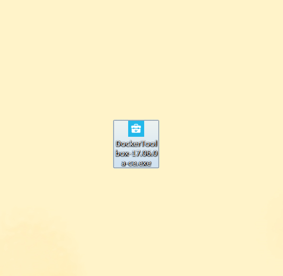
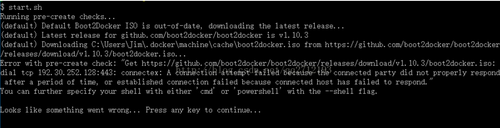

# 在window下使用docker安装oracle数据库
> 目前docker已经稳定支持window10系统，在window上安装docker比window其他系统要方便很多，不过这里也讲解下window7的安装方法。


## 安装docker

### window10
访问[Docker官网](https://www.docker.com/)，下载对应Docker。

如图：
1. 
2. 
3. 

4. 下载完成后，得到一个.msi的文件，这个是docker的安装向导。

未完待续。。。

### window7
- 由于没有直接支持window7的安装包，需要在官网上下载能运行docker的工具（DockerToolbox），[链接](https://www.docker.com/products/docker-toolbox)。

  > 但是这个地址被墙了，下载速度很慢，有vpn的可以尝试下。

- 访问[国内的资源](http://get.daocloud.io/#install-docker-for-mac-windows)


- 下载完成后，得到安装包


- 点击运行

如果没有git的就勾选，安装下吧。


点击 next 之后点击  install。 等待片刻。。。

- 安装完成后桌面出现三个图表


- 点击Docker Quickstart Terminal初次运行。这一步骤可能会报错。
  - 手动启动虚拟机，提示VT-x/AMD-V 硬件加速在系统中不可用；
    重启电脑开启cpu支持虚拟机，不同的主板可能操作不同。一般在：高级 -> cpu里面。
     
  - 虚拟机ip获取不到
  

  - 打开后，若在bash界面提示没有boot2docker镜像，需要在github上下载，提示大概如下
  
  这是因为没有找到默认的boot2docker镜像的原因，提示正在下载，然而github的下载速度不可恭维，第一反应都是找别的站资源下载。
  不过在一开始安装好的DockerToolbox根目录下就有一个boot2docker.iso。
  
  将这个文件拷贝到C:\Users\Administrator\.docker\cache文件夹下，Administrator是当前用户，根据自己实际来。
  拷贝完成之后，再运行Docker Quickstart Terminal，如果还是提示boot2docker.iso不是最新，需要下载，那就老老实实去github上下载吧，[下载地址](https://github.com/boot2docker/boot2docker/releases)。
  同样，下载完后放在C:\Users\Administrator\.docker\cache文件夹下。

  - 若点击Docker Quickstart Terminal图标后，提示window正在查找bash.exe的话，点击浏览自己查找。一般在Git所安装下的bin目录。

- 由于Docker Quickstart Terminal这个终端不能复制粘贴，果断放弃选择另外的方法连接docker的宿主虚拟机吧。
  - 设置虚拟机的网络连接方式，改为桥接，便于虚拟机上网连接
  
  - 直接进入virtualBox得到ip地址，然后使用连接工具，连接虚拟机。我这里使用的是Xshell5，百度直接下载安装。
  
  
  
  输入命令  ``` ifconfig ``` 
  
  使用这个ip连接虚拟机。默认用户名docker,密码：tcuser
  
  

